# Plant.ly 🌱

Plant.ly é uma aplicação completa para gerenciamento de plantas, permitindo que usuários monitorem e cuidem de suas plantas de forma eficiente. O projeto é dividido em três partes principais: frontend web, aplicativo mobile e backend.

## 👥 Autores

- Rafael - [GitHub](https://github.com/RafaelVSs)
- Bruno - [GitHub](https://github.com/Brunoalgarte)
- Eduardo - [GitHub](https://github.com/eduardovbf)


## 🏗️ Estrutura do Projeto
```
plant.ly/
├── IoT/ # Projeto IoT
│ ├── dashbaord_grafana/ # Import do dashboard
│ └── script_sensordatas/ # Código Python
├── client/ # Projeto Next.js
│ ├── public/
│ └── src/
│   ├── app/ # Páginas e rotas
│   ├── components/ # Componentes React
│   ├── lib/ # Utilitários
│   └── utils/ # Hooks e funções auxiliares
│
├── mobile/ # Projeto React Native
│ ├── expo/ # Configurações do Expo
│ └── src/
│   ├── @types/ # Definições de tipos TypeScript
│   ├── assets/ # Recursos estáticos
│   ├── components/ # Componentes React Native
│   ├── global/ # Configurações globais
│   ├── pages/ # Telas do aplicativo
│   ├── types/ # Interfaces e tipos
│   └── utils/ # Utilitários e helpers
│
└── server/ # API Express
    └── api/
        └── v1/ # Versão 1 da API
            ├── controllers/ # Controladores da aplicação
            ├── middlewares/ # Middlewares personalizados
            ├── models/ # Schemas Mongoose
            ├── routes/ # Rotas da API
            └──  schemas/ # Schemas de validação

```

### Requisitos
- Node.js 18+
- MongoDB
- Expo CLI (mobile)
- Yarn ou NPM


## 🖥️ Frontend Web (Next.js)


### 🚀 Tecnologias Utilizadas

- Next.js 14
- TypeScript
- Tailwind CSS

### 🕹️ Funcionalidades Principais

- Autenticação de usuários (Login/Registro)
- Reset de senha
- Dashboard com estatísticas
- Gerenciamento de plantas
- Perfil do usuário

### 🛠️  Como Executar

abra um terminal na pasta plant.ly e execute o comando:

```
bash

cd client
npm install
npm run dev
```

### 📸 Telas frontend

- Tela de login / Cadastro de usuário

  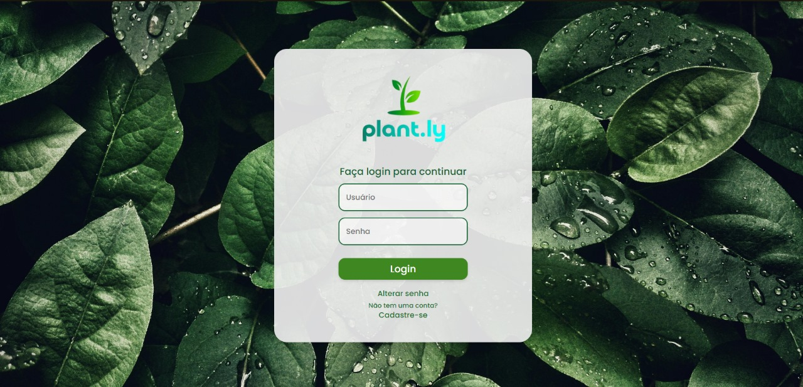  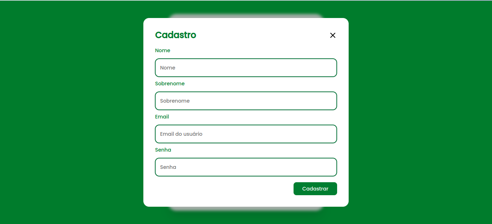


- Tela de entrada / Tela de Dados


  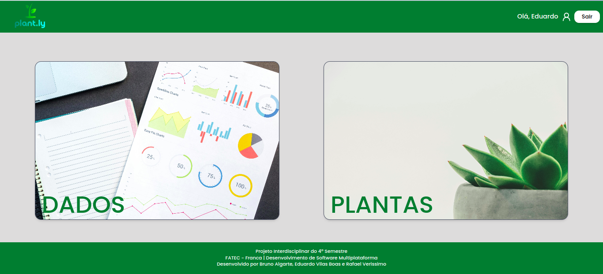  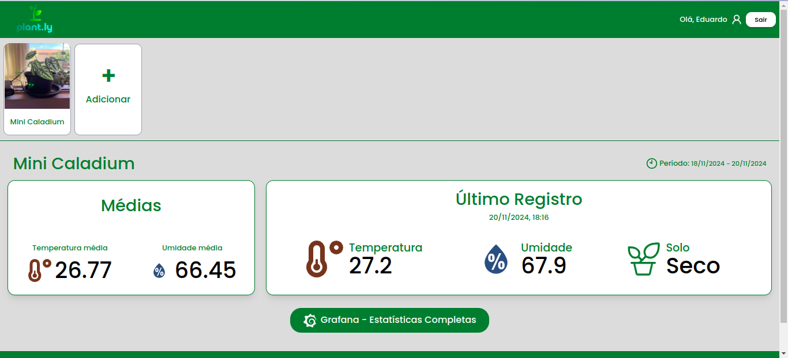


- Tela minhas plantas  / Cadastro de planta

  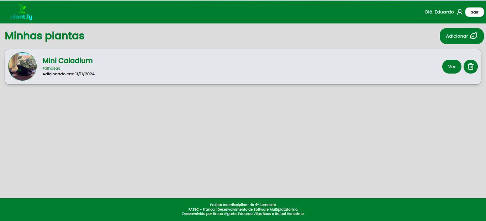  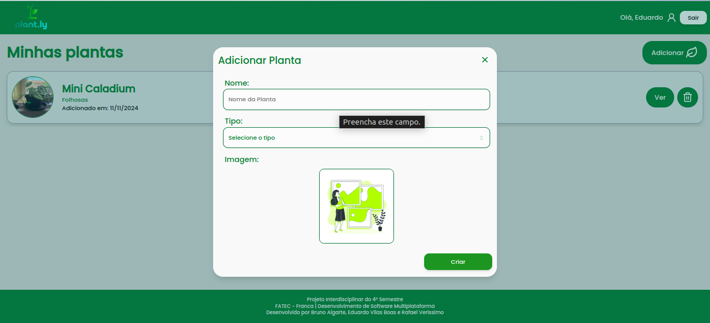


# 🔙 Backend (Express)

### 🚀 Tecnologias Utilizadas

- Node.js
- Express
- MongoDB
- OnpenApi


### 🛠️ Como Executar

```
bash

cd server
npm install
# Configure o .env com as variáveis do MongoDB
npm run dev
```

### 🔐 Variáveis de Ambiente

env
MONGODB_URI="mongodb://seu_link_do_mongo"
PORT=

# 📱 Mobile (React Native)

### 🚀 Tecnologias Utilizadas

- React Native
- Expo
- TypeScript

### 🕹️ Funcionalidades Principais

- Autenticação de usuários (Login/Registro)
- Reset de senha
- Dashboard com estatísticas
- Gerenciamento de plantas
- Perfil do usuário
- Câmera para fotos das plantas

### 🛠️  Como Executar

abra um terminal na pasta plant.ly e execute o comando:

```
bash

cd mobile
npm install
# Baixe no seu celular o app Expo Go
npx expo start
# Escaneie o QR Code com o app Expo Go
```
### 📸 Telas mobile

- Tela de login / Cadastro de usuário

  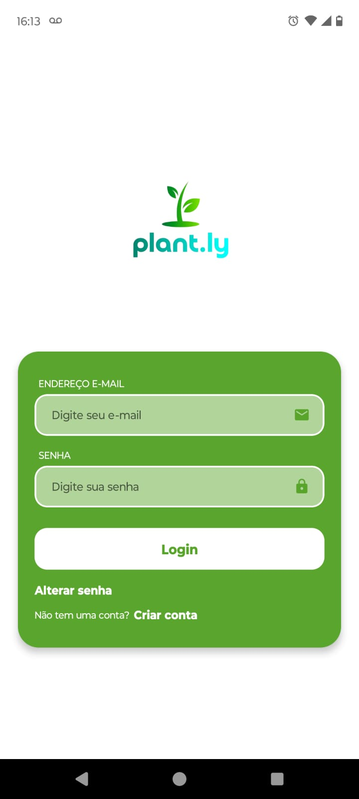  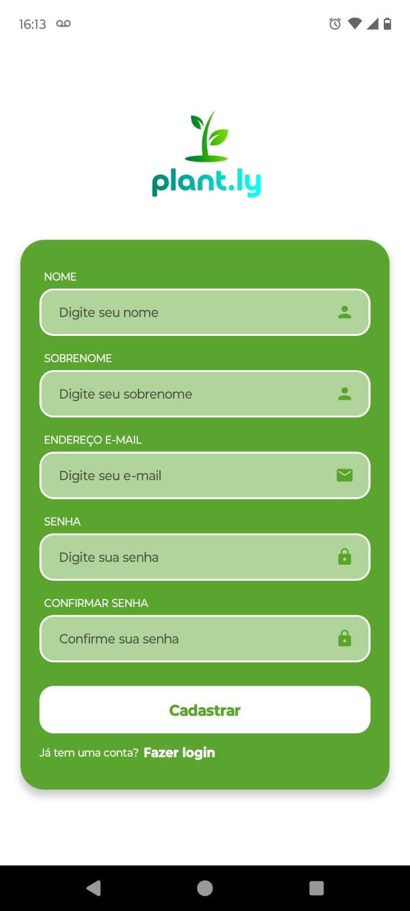

- Tela alteração de senha / Cadastro de plantas

    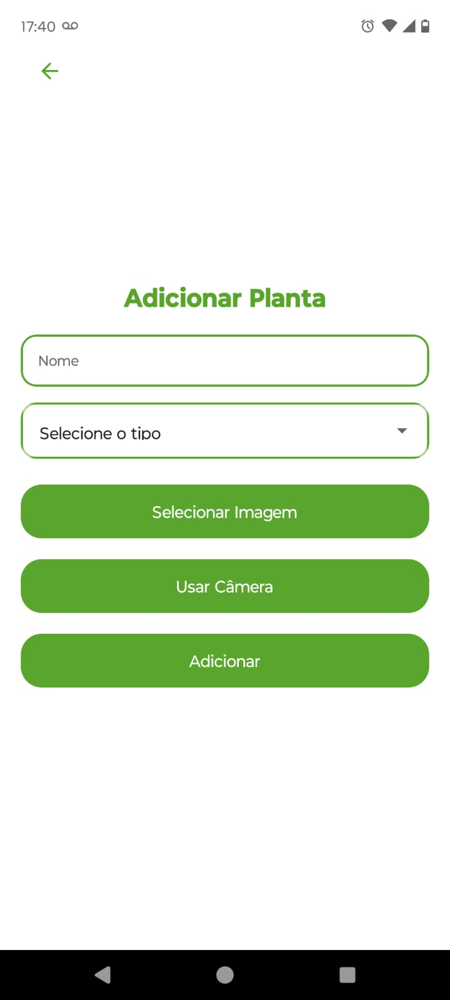

- Tela minhas plantas / Dados da planta

  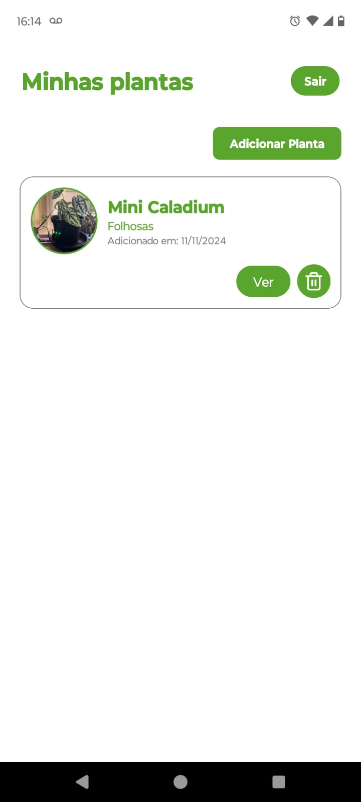  

- Gráficos

    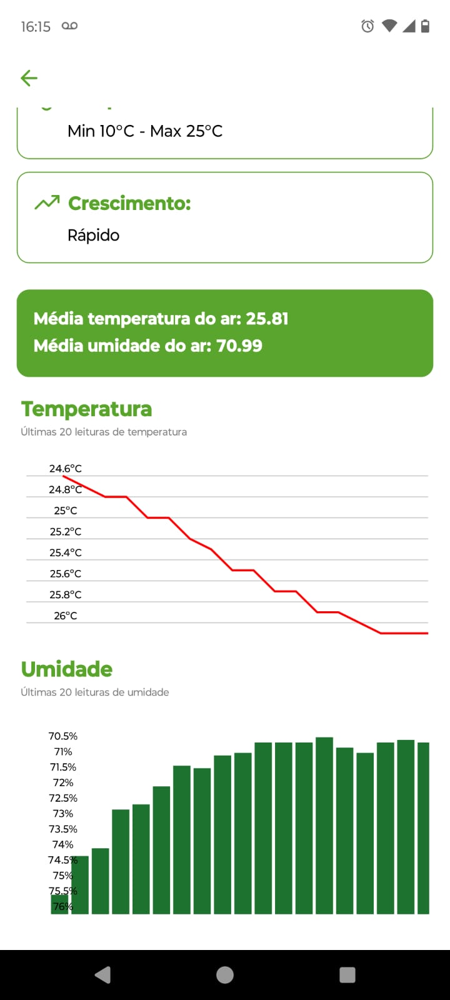

 

# 🌐 Iot e estátisticas

### 🚀 Tecnologias Utilizadas

- Python 
- Bibliotecas: 
- Grafana Cloud


### 🌡️ Sensores

- **Sensor de temperatura e umidade do ar DHT22**

  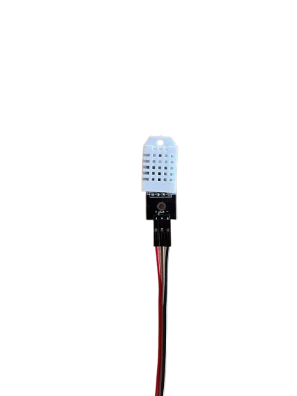
  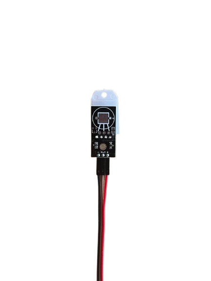
  
- **Sensor de umidade do solo digital**


  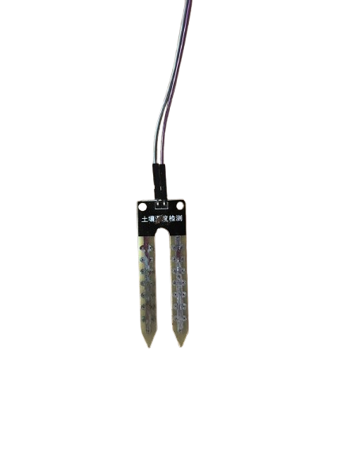
  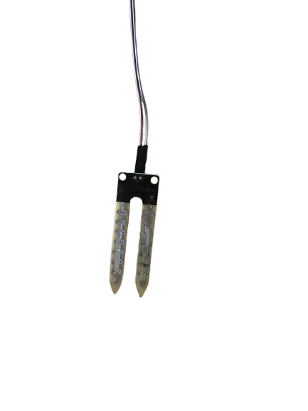

- **Raspberry PI 3.0**


  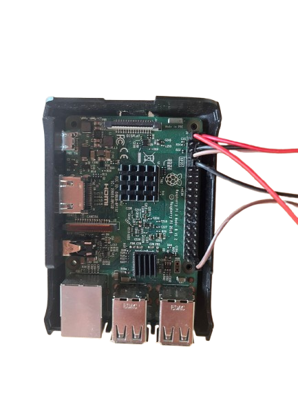

### 🪛 Configuração

```
🖇️ Pinos do Sensor DHT22
VCC: Alimentação (+3.3V ou +5V do Raspberry Pi)
DATA: Pino de dados para comunicação com o Raspberry Pi
GND: Terra (Ground)

🔌 Conexão com o Raspberry Pi
Conecte o pino VCC do DHT22 a um dos pinos de 3.3V ou 5V do Raspberry Pi.
Conecte o pino DATA a um dos pinos GPIO do Raspberry Pi (ex.: GPI21).
Conecte o pino GND ao GND do Raspberry Pi.

🖇️ Pinos do Sensor de Umidade do Solo
VCC: Alimentação (+3.3V ou +5V do Raspberry Pi)
AO: Saída analógica (não usada no Raspberry Pi sem conversor ADC)
DO: Saída digital (para GPIO)
GND: Terra (Ground)

🔌 Conexão com o Raspberry Pi
Conecte o pino VCC do sensor ao 3.3V do Raspberry Pi.
Conecte o pino DO (Saída Digital) a um pino GPIO (ex.: GPIO17).
Conecte o pino GND ao GND do Raspberry Pi.

```

### 📚 Leitura dos dados

### 📊 Dashboard estatístico

```
- Crie uma conta no Grafana Cloud.
- Intale o plugin "Infinyt", configure um novo data source com a URL local da api.
- Na tela de dashboards realize a importação do arquivo, /IoT/dashboard_grafana.json.
- Realize o filtro de acordo com a data da coleta dos dados.
- Compartilhe o gráfico como público para uso externo.
```
  
### 📈 Métricas: 
Média,moda,mediana,desvio padrão, assimetria,projeção futura,máxima,mínima e último registro.  
(cálculos realizados no backend da aplicação)

### 📸 Gráficos:

 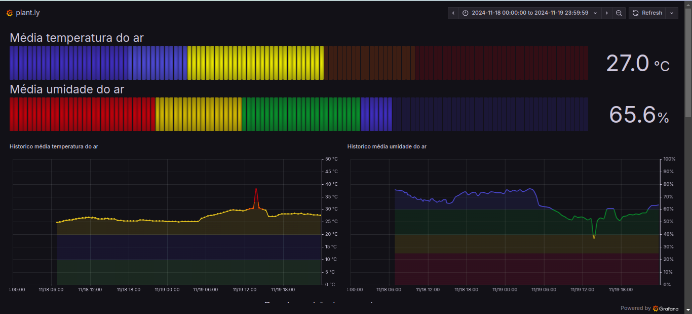
 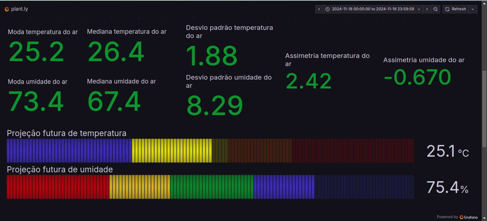
 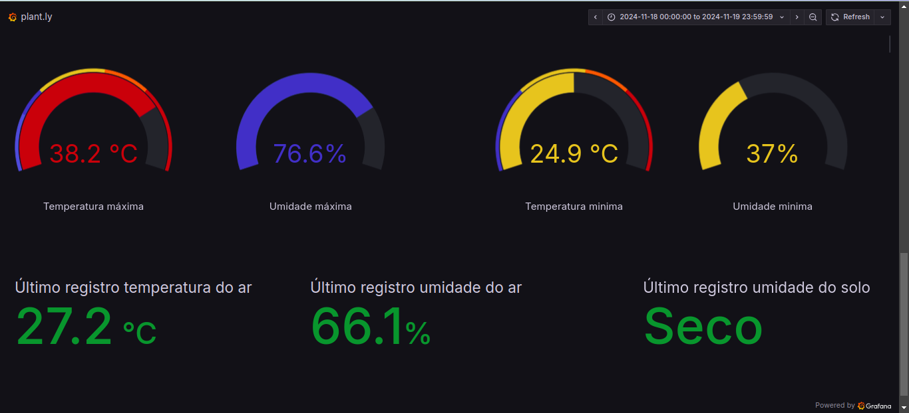


- [Dashborad Plant.ly](https://brunoalgter.grafana.net/public-dashboards/c35726a3560941c5af48617424b9ddb1?orgId=1)


## 📝 Licença

Este projeto está sob a licença MIT. Veja o arquivo [LICENSE](LICENSE) para mais detalhes.

